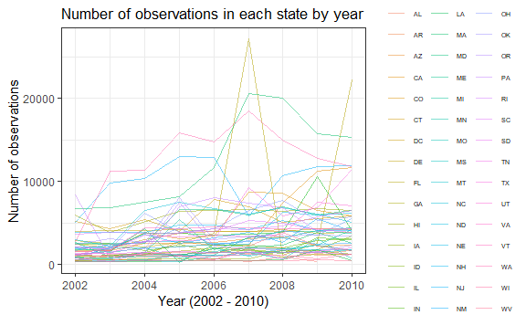
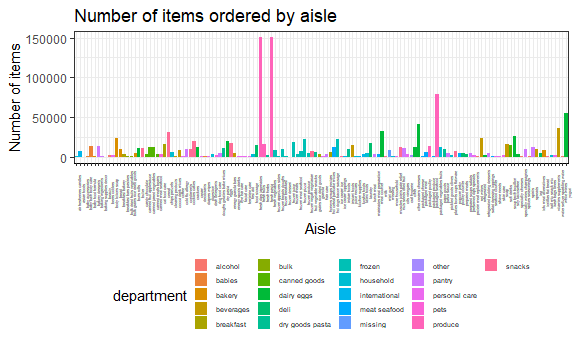

p8105\_hw3\_fwt2107
================
Felix Tran
October 4, 2018

Problem 1
=========

Data cleaning
-------------

This block of code loads and cleans the BRFSS data:

1.  Load the BRFSS data from the p8105.datasets package

2.  Clean the variable names

3.  Only keep the observations related to the Overall Health topic

4.  Remove unneeded variables

5.  Transform **response** into a factor with the values ordered from "Excellent" to "Poor"

6.  Separate **locationdesc** into 2 variables (**state** and **location**) for the state and site for each observation

7.  Remove the redundant **locationabbr** variable

``` r
library(p8105.datasets)
brfss_df <- brfss_smart2010 %>% 
  janitor::clean_names() %>%
  filter(topic == "Overall Health") %>%
  select(-class, -topic,  -question, -c(confidence_limit_low:geo_location)) %>%
  mutate(response = forcats::fct_relevel(response, "Excellent", "Very good",
                                         "Good", "Fair", "Poor")) %>% 
  separate(locationdesc, into = c('state', 'location'), sep = ' - ') %>%
  select(-locationabbr)

brfss_df
```

    ## # A tibble: 10,625 x 6
    ##     year state location         response  sample_size data_value
    ##    <int> <chr> <chr>            <fct>           <int>      <dbl>
    ##  1  2010 AL    Jefferson County Excellent          94       18.9
    ##  2  2010 AL    Jefferson County Very good         148       30  
    ##  3  2010 AL    Jefferson County Good              208       33.1
    ##  4  2010 AL    Jefferson County Fair              107       12.5
    ##  5  2010 AL    Jefferson County Poor               45        5.5
    ##  6  2010 AL    Mobile County    Excellent          91       15.6
    ##  7  2010 AL    Mobile County    Very good         177       31.3
    ##  8  2010 AL    Mobile County    Good              224       31.2
    ##  9  2010 AL    Mobile County    Fair              120       15.5
    ## 10  2010 AL    Mobile County    Poor               66        6.4
    ## # ... with 10,615 more rows

Answering questions about the data
----------------------------------

### States observed at 7 locations in 2002

3 states were observed at 7 locations in 2002: Connecticut, Florida, and North Carolina.

Using the brfss\_df dataset:

1.  Filter observations to only look at observations from 2002

2.  Group by **state**

3.  Count the number of unique **location** values and only see the states with 7 location sites

``` r
brfss_df %>% 
  filter(year == '2002') %>% 
  group_by(state) %>%
  summarize(num_sites = length(unique(location))) %>% 
  filter(num_sites == 7)
```

    ## # A tibble: 3 x 2
    ##   state num_sites
    ##   <chr>     <int>
    ## 1 CT            7
    ## 2 FL            7
    ## 3 NC            7

### Spaghetti plot

1.  Group the brfss data by year and state

2.  Sum up the number of observations for each state by year

3.  Plot the number of observations for each state by year

4.  Add labels and adjust the plot theme and legend font size

``` r
brfss_df %>% 
  group_by(year, state) %>% 
  summarize(total_obs = sum(sample_size)) %>% 
  ggplot(aes(x = year, y = total_obs, color = state)) + 
  geom_line(alpha = 0.5) + 
  labs(title = "Number of observations in each state by year", 
       x = "Year (2002 - 2010)",
       y = "Number of observations") +
  theme(legend.text = element_text(size = 5),
        plot.title = element_text(size = 13))
```



Most states had less than 5000 observations per year. Only a few states had more than 10,000 observations for at least 1 year of data collection.

### Table describing "Excellent" responses in NY (2002, 2006, 2010)

1.  Subset the brfss data to only look at "excellent" responses for NY

2.  Group observations by year

3.  Calculate the mean and standard deviation for proportion of "excellent" responses in NY by year

4.  Keep the means and standard deviations for the years 2002, 2006, 2010

5.  Display results in table

``` r
brfss_df %>% 
  filter(state == "NY", response == "Excellent") %>% 
  group_by(year) %>% 
  summarize(mean_excellent = mean(data_value, na.rm = T), 
            sd_excellent = sd(data_value, na.rm = T)) %>% 
  filter(year == "2002" | year == "2006" | year == "2010") %>% 
  knitr::kable(col.names = c("Year", "Mean", "Standard deviation"), 
               digits = 1,
               format = 'html',
               caption = "Proportion of 'excellent' responses in NY by year")
```

<table>
<caption>
Proportion of 'excellent' responses in NY by year
</caption>
<thead>
<tr>
<th style="text-align:right;">
Year
</th>
<th style="text-align:right;">
Mean
</th>
<th style="text-align:right;">
Standard deviation
</th>
</tr>
</thead>
<tbody>
<tr>
<td style="text-align:right;">
2002
</td>
<td style="text-align:right;">
24.0
</td>
<td style="text-align:right;">
4.5
</td>
</tr>
<tr>
<td style="text-align:right;">
2006
</td>
<td style="text-align:right;">
22.5
</td>
<td style="text-align:right;">
4.0
</td>
</tr>
<tr>
<td style="text-align:right;">
2010
</td>
<td style="text-align:right;">
22.7
</td>
<td style="text-align:right;">
3.6
</td>
</tr>
</tbody>
</table>
The proportion of "Excellent" responses has decreased slightly from 2002 to 2010. The standard deviation has decreased from 2002 to 2010.

### 5 panel plot of responses over time

1.  Spread the values of the **response** variable so that each answer choice in **response** is a separate column

2.  Clean the variable names and group by state and year

3.  Summarize the data by calculating the average proportion of each answer choice by state and year

4.  Gather the average proportions of each answer choice so that variable **response** contains the answer choices and **avg\_prop** contains the average proportion of each answer choice by state and year

5.  Relevel the **response** variable so that the answers are shown in order of "best to worst" rather than in alphabetical order

6.  Plot the average proportion of each answer choice across time by state

``` r
brfss_df %>% 
  spread(key = response, value = data_value) %>% 
  janitor::clean_names() %>%
  group_by(state, year) %>%
  summarize(excellent_mean = mean(excellent, na.rm = T),
            verygood_mean = mean(very_good, na.rm = T),
            good_mean = mean(good, na.rm = T),
            fair_mean = mean(fair, na.rm = T),
            poor_mean = mean(poor, na.rm = T)) %>%
  gather(key = response, value = avg_prop, excellent_mean:poor_mean) %>%
  separate(response, into = c("response", "unneeded_var"), sep = "_") %>%
  select(-unneeded_var) %>%
  mutate(response = forcats::fct_relevel(response, "excellent", "verygood",
                                         "good", "fair", "poor")) %>%
  ggplot(aes(x = year, y = avg_prop, color = state)) +
  geom_line(alpha = 0.75) +
  labs(title = "Responses across states by year (2006 - 2010)",
       x = "Year",
       y = "Proportion of responses (%)") +
  scale_x_continuous(breaks = c(2002, 2006, 2010),
                     labels = c("2002", "2006","2010")) +
  facet_grid(. ~ response, 
             labeller = labeller(response = c(excellent = "Excellent",
                                             verygood = "Very good",
                                             good = "Good",
                                             fair = "Fair",
                                             poor = "Poor"))) +
  theme(legend.position = "none",
        axis.text = element_text(size = 5),
        panel.spacing.x = unit(0.5, "lines"))
```


On average, the proportion of "Excellent" responses has decreased slightly over time across states. The proportion of "Very good" and "Good" responses had substantial variation over time across states. The proportion of "Fair" responses had less variation over time. The proportion of "Poor" responses remained fairly consistent over time across states at close to 5% of all responses.

Problem 2
=========

Describing the data
-------------------

-   The dataset contains 1384617 observations and 15 variables. Each observation is 1 food item bought in an order.

-   The dataset contains 131209 unique users with 131209 total orders.

-   Users in this dataset have placed 17 orders on average through Instacart thus far, waiting about 17 days before placing another order.

-   On average, 11 items are purchased per order.

-   Users in this dataset have ordered items from 21 different departments.

Answering questions
-------------------

### Aisles

There are 134 aisles, and the most items are ordered from fresh vegetables, fresh fruit, packaged fruits and vegetables, yogurt, and packaged cheese.

``` r
cart_df %>% 
  group_by(aisle) %>% 
  summarize(total_items = n()) %>% 
  arrange(desc(total_items))
```

    ## # A tibble: 134 x 2
    ##    aisle                         total_items
    ##    <chr>                               <int>
    ##  1 fresh vegetables                   150609
    ##  2 fresh fruits                       150473
    ##  3 packaged vegetables fruits          78493
    ##  4 yogurt                              55240
    ##  5 packaged cheese                     41699
    ##  6 water seltzer sparkling water       36617
    ##  7 milk                                32644
    ##  8 chips pretzels                      31269
    ##  9 soy lactosefree                     26240
    ## 10 bread                               23635
    ## # ... with 124 more rows

### Graph of items ordered per aisle

1.  Group items by department and aisle

2.  Summarize to add up number of items ordered per aisle

3.  Plot bar graph of number of ordered times by aisle. Bars are colored according to department to make plot more readable

``` r
cart_df %>% 
  group_by(department, aisle) %>% 
  summarize(total_items = n()) %>% 
  ggplot(aes(x = aisle, y = total_items)) +
  geom_bar(stat = "identity", aes(fill = department)) +
  labs(title = "Number of items ordered by aisle",
       x = "Aisle",
       y = "Number of items") +
  theme(axis.text.x = element_text(size = 3, angle = 90),
        axis.line.x = element_line(size = 0)) +
  theme(legend.position = "bottom",
        legend.key.size = unit(0.75, "lines"),
        legend.text = element_text(size = 5))
```



### Table

To make the table:

1.  Filter out items from different aisles

2.  Group by product and aisle, then count up number of times each product was ordered

3.  Within each aisle, rank products by number of times purchased

4.  Look at the most purchased item in each aisle, then display as a table

``` r
cart_df %>% 
  filter(aisle == "baking ingredients" | aisle == "dog food care" | 
           aisle == "packaged vegetables fruits") %>% 
  group_by(product_name, aisle) %>% 
  summarize(num_bought = n()) %>% 
  group_by(aisle) %>% 
  mutate(num_rank = min_rank(desc(num_bought))) %>% 
  filter(num_rank == 1) %>% 
  select(aisle, product_name, -num_bought, -num_rank) %>% 
  knitr::kable(col.names = c("Aisle", "Product"),
               format = "html",
               caption = "Most popular items of selected aisles")
```

<table>
<caption>
Most popular items of selected aisles
</caption>
<thead>
<tr>
<th style="text-align:left;">
Aisle
</th>
<th style="text-align:left;">
Product
</th>
</tr>
</thead>
<tbody>
<tr>
<td style="text-align:left;">
baking ingredients
</td>
<td style="text-align:left;">
Light Brown Sugar
</td>
</tr>
<tr>
<td style="text-align:left;">
packaged vegetables fruits
</td>
<td style="text-align:left;">
Organic Baby Spinach
</td>
</tr>
<tr>
<td style="text-align:left;">
dog food care
</td>
<td style="text-align:left;">
Snack Sticks Chicken & Rice Recipe Dog Treats
</td>
</tr>
</tbody>
</table>
